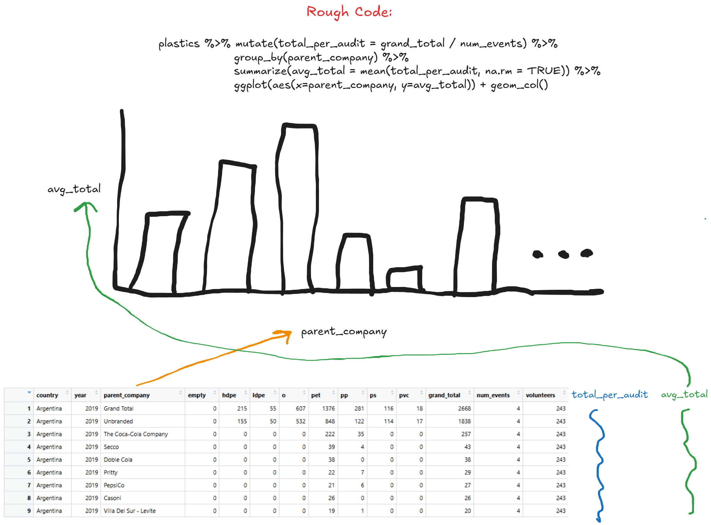
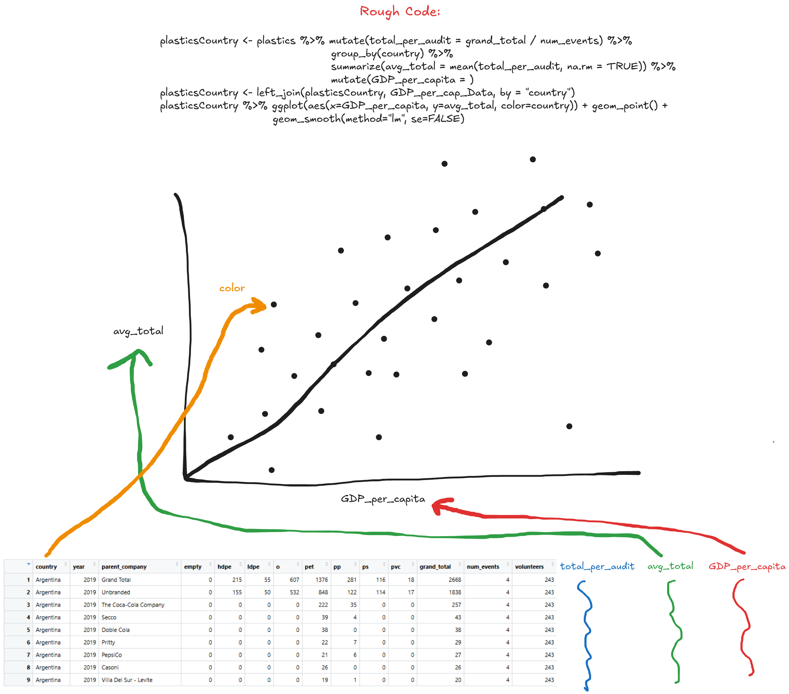

## Context of the Data Set

The data set I am working with is called "Environmental: Plastic Waste." This data was composed by Sarah Sauve with *Break Free From Plastic*, a movement to reduce single-use plastics and combat plastic pollution. All together it contains information about plastic audits in different countries through 2019 and 2020 which tracks plastic counts by type and the company responsible. Using this data can help hold corporations accountable and track trends in plastic waste.

There are 12 variables in the data set:

-   "country" represents the country the data set took place in.

-   "year" indicates whether it occurred in 2019 or 2020.

-   "parent_company" indicates which company the pollution belongs to.

-   "empty" is the count of uncategorized plastic.

-   "hdpe" is the count of high density polyethylene.

-   "ldpe" is the count of low density polyethylene.

-   "o" is the count of other categories from those listed.

-   "pet" is the count of polyester plastic.

-   "pp" is the count of polypropylene.

-   "ps" is the count of polystyrene.

-   "pvc" is the count of pvc plastic.

-   "grand_total" represents the total count of all types of plastic within each company / year / country.

-   "num_events" represents the number of counting events.

-   "volunteers" indicates the number of volunteers at the cleanup.

## Data Cleaning

Prior to the publication of the final set *plastics.csv*, cleaning of the raw data was performed to make the data set easier to read and work with. The data corresponding to 2019 and 2020 were contained in two separate files. Each converted "Country", "Parent_company", and "Grand_Total" to character variables for consistency, and the rest of the variables were converted to double variables for compatible numeric values. The variable "year" was created to add the respective year to each data set, and was placed after the "country" variable. In the 2019 data, the "pp" and "ps" variables had to be cleaned to ensure *NA* values were appropriate, and unnecessary variables "ps_2" and "pp_2" were removed. In the 2020 data, the parse_number function was used to extract the numeric value for the Grand_total variable. Names were cleaned with the clean_names function in the janitor package, and rename to match the variable names in both the 2019 and 2020 data sets. The final data set was combined with bind_rows and written to a .csv file. These steps ensured the data was able to be analyzed with minimal obstacles.

## Research Questions

1.  Which country has the largest number of volunteers per audit on average?

2.  Which company tends to produce the largest grand total of plastic pollution per audit?

## Research Questions with Extra Data

1.  Do companies with larger plastic pollution grand totals have higher annual net profits?

2.  Do countries with larger GDPs per capita correspond with larger plastic pollution totals?

## Visualizations

-   [Which company tends to produce the largest grand total of plastic pollution per audit?]{.underline}

    

-   [Do countries with larger GDPs per capita correspond with larger plastic pollution totals?]{.underline}

    
